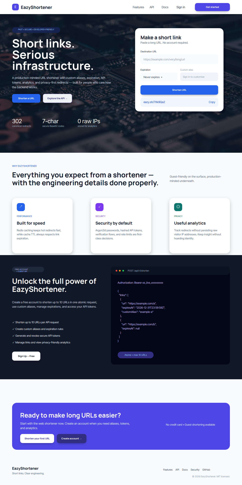

# EazyShortener Landing Page — Locked Design

Status: **Locked / approved final**  
Locked on: **2026-08-22**

## Penpot reference

- Board: `EazyShortener — Landing Page Draft`
- Board ID: `e14553f4-d237-80b5-8008-85368743fbec`
- Penpot status: `locked-final`

The exported desktop reference is the implementation baseline for the v1 guest landing page:

## Visual direction

- Heading typography: **Manrope**
- Body typography: **Inter**
- Technology/circuit-board hero image with a dark readability overlay
- Primary actions use high-contrast blue/violet treatments with visible depth/shadow
- `Explore the API` uses a light contrasting treatment so it does not blend into the hero background
- Feature presentation emphasizes performance, security, and privacy
- Membership/API section invites users to create a free account and exposes the `Sign Up — Free` CTA
- Final CTA and footer follow the approved Penpot composition

## Implementation rule

The server-rendered NestJS landing page should visually follow this locked reference. Responsive, semantic HTML, accessibility, content-state, and browser-compatibility requirements may require proportional layout changes, but the approved visual hierarchy, typography, color system, hero treatment, CTA emphasis, and section composition should remain recognizable.

Any deliberate visual redesign beyond those implementation necessities should be reviewed against this locked reference before replacing it.
